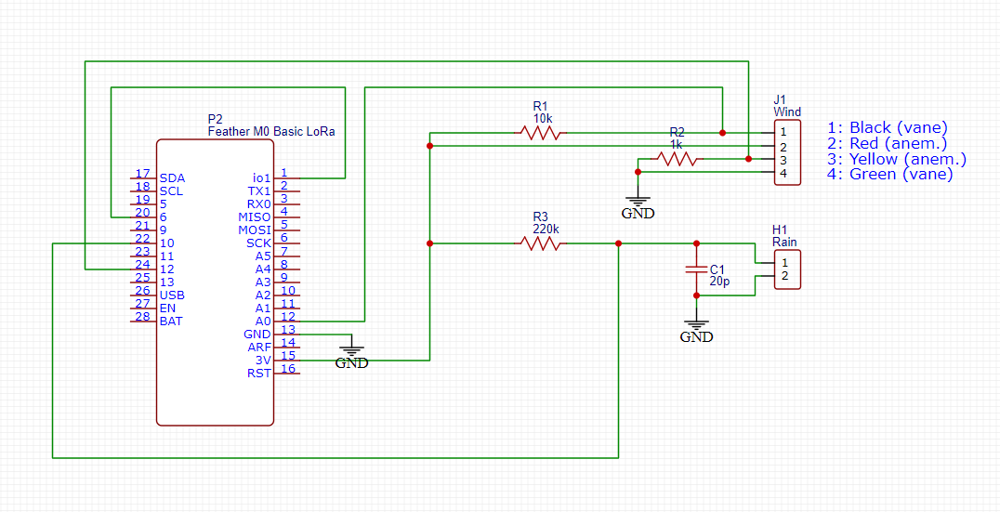

# SEN-15901 Arduino Library

Use this library to measure rainfall, wind direction and wind speed with the SEN-15901 sensor kit.

## Circuit
Example circuit with an Adafruit Feather M0 board:

## Calibration
The wind vane requires precise calibration to get the correct values:
1) Measure the exact value of your resistor and assign it to **VANE_RESISTOR**. If you're powering the sensor with 3.3V, this might be enought. If not, follow calibration step 2.

2) - Upload a program to the board that reads the analog value of your vane (A0 in the example circuit)
    - Using Ohms Law, measure the resistor value for each direction of the vane. 
    - Then open the source code of the library and edit resistor ranges in the mapping() function according to your measured values.